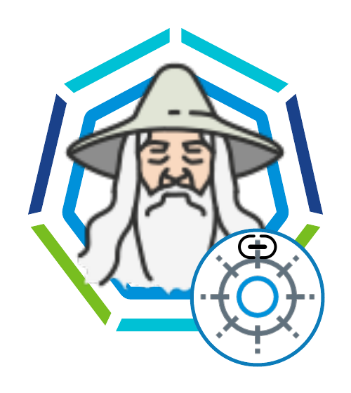

# TMC Attach wizard


This is a bootstrap environment with
- az cli
- aws cli
- tmc (optional)
- akstmcwizard --> lets you create aks cluster and attach to tmc via a simple prompt (recommended)
- akscreateandattach --> lets you create aks cluster and attach to tmc through passing parameters.

## Prepare

### .env file (optional but recommended)

`mv .env.sample .env`

This is optional. Needed when the preferred az login is using a az application via service principal (which is often the most prefered method). To create a an azure application and service principal follow this guide: https://docs.vmware.com/en/VMware-Tanzu-Kubernetes-Grid/1.3/vmware-tanzu-kubernetes-grid-13/GUID-mgmt-clusters-azure.html#register-tanzu-kubernetes-grid-as-an-azure-client-app-3

The .env also contains a field called `TMC_API_TOKEN`. When value provided you will get a more easy experience with this wizard. You must have the TMC binary available. Without the TMC binary the only option is to use the `--tmc-attach-url`

***If you want to login using interactive mode skip this step. The wizard will check env file and if not present it will automatically go into az login interactive mode.***

Values of .env files:
- AZ_TENANT_ID={search 'tenant properties' in portal to get the azure tenant id}
- AZ_TKG_APP_ID={APP_ID is also known as CLIENT_ID. in portal search 'app registration' > New Regitration. the process is documented here: https://docs.vmware.com/en/VMware-Tanzu-Kubernetes-Grid/1.3/vmware-tanzu-kubernetes-grid-13/GUID-mgmt-clusters-azure.html#register-tanzu-kubernetes-grid-as-an-azure-client-app-3 }
- AZ_TKG_APP_CLIENT_SECRET={recorded secret from the above}
- AZ_SUBSCRIPTION_ID={azure subscription id}
- TMC_API_TOKEN={create a tmc api token.}
    - Navigate to https://console.cloud.vmware.com/csp/gateway/portal/#/user/profile (OR on tmc console click username at the top right corner > click My Accout)
    - API Tokens tab
    - Generate Token and Record the token value. Keep it in a secret secured location as this is the only time you will have opportunity to record it.


### tmc binary (optional but recommended)

Download the tmc binary from `https://{yourorg}.tmc.cloud.vmware.com/clidownload` and place under `binaries` directory. (eg: `mv ~/Downloads/tmc binaries/`)

Without the TMC binary the only option is to use the `--tmc-attach-url`

***if you do not wish to add tmc binary you MUST comment the lines for adding tmc (line #46 #47) from Dockerfile***

## Run
```
docker build . -t tmcattach
docker run -it --rm --net=host -v ${PWD}:/root/ -v /var/run/docker.sock:/var/run/docker.sock --name tmcattach tmcattach /bin/bash
```

# That's it
Simple stuff.

# handy commads:

az documentation: https://docs.microsoft.com/en-us/cli/azure/aks?view=azure-cli-latest#az_aks_create


delete az cluster
```
az aks delete --name MyManagedCluster --resource-group MyResourceGroup
```
